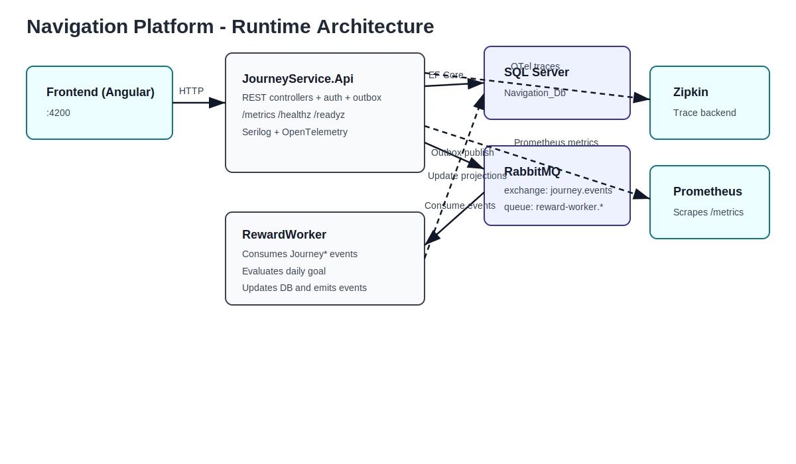

# Navigation Platform

Navigation Platform is a Clean Architecture solution with:

- `JourneyService.Api` (HTTP API + auth + outbox publisher)
- `RewardWorker` (RabbitMQ consumer/background worker)
- `frontend` (Angular web app)
- SQL Server, RabbitMQ, Zipkin via Docker Compose

## Architecture Choice

This project currently uses the **allowed fallback: modular monolith** for the core backend API, plus an independently deployable `RewardWorker`.

### Why modular monolith was chosen

1. Faster delivery for course/task scope
- A single API deployable reduced setup and coordination overhead while still enforcing module boundaries.

2. Lower operational complexity
- Fewer deployables, simpler local development, and easier debugging while requirements were still evolving.

3. Same event-driven shape as microservices
- Internal bounded contexts communicate through domain events + outbox, and external async flow uses RabbitMQ.
- This preserves migration-path compatibility to full microservices.

### Current bounded contexts/modules

- Auth/Account
- Journeys
- Sharing/Favorites/Notifications
- Rewards (processed by `RewardWorker`)
- Admin/Reporting

## One-Command Startup

```bash
docker compose up --build
```

Main URLs:

- Frontend: `http://localhost:4200`
- API: `http://localhost:5000`
- RabbitMQ Management: `http://localhost:15672`
- Zipkin: `http://localhost:9411`
- Metrics: `http://localhost:5000/metrics`
- Health: `http://localhost:5000/healthz`, `http://localhost:5000/readyz`

## Architecture Diagram



## Repository Deliverables

- Clean Architecture source:
  - `src/JourneyService.Domain`
  - `src/JourneyService.Application`
  - `src/JourneyService.Infrastructure`
  - `src/JourneyService.Api`
  - `src/RewardWorker`
- Frontend source:
  - `frontend/`
- Containerization:
  - `Dockerfile` (API)
  - `src/JourneyService.Api/Dockerfile`
  - `src/RewardWorker/Dockerfile`
  - `frontend/Dockerfile`
  - `docker-compose.yml`
- CI/CD workflows:
  - `.github/workflows/ci-cd.yml`
- API collection:
  - `ops/postman/Navigation_Platform.postman_collection.json`
- Test report and coverage badges:
  - `reports/test-report.md`
  - `reports/badges/backend-coverage.svg`
  - `reports/badges/frontend-coverage.svg`

## Design Decisions And Trade-Offs

1. Clean Architecture separation
- Decision: split into Domain, Application, Infrastructure, and API projects.
- Trade-off: more project boundaries and wiring, but better long-term maintainability and testability.

2. Outbox + RabbitMQ for reliable async events
- Decision: domain events are persisted to `OutboxMessage`, then published by a background job.
- Trade-off: eventual consistency and extra moving parts, but safer delivery than direct publish in request flow.

3. Worker isolation
- Decision: reward processing is in `RewardWorker`, not inside API.
- Trade-off: added deployment unit, but isolates heavy/background logic and scales independently.

4. Docker Compose for local integration
- Decision: single compose file for DB, broker, API, worker, frontend, Zipkin.
- Trade-off: local startup can be slower, but environment parity and reproducibility improve.

5. Observability built-in
- Decision: Serilog JSON logs, OpenTelemetry traces (Zipkin), Prometheus metrics, health endpoints.
- Trade-off: more configuration and dependencies, but significantly faster troubleshooting and production diagnostics.

## EF Core Persistence And Migrations

- Journeys and related entities are persisted with **Entity Framework Core**.
- Migrations are applied automatically on startup in `src/JourneyService.Api/Program.cs` via `db.Database.Migrate()`.
- Startup uses retry logic so containerized environments can wait for SQL readiness before applying migrations.

## Production Scaling Strategy

1. Stateless API horizontal scaling
- Run multiple API replicas behind a load balancer.

2. Worker scaling by queue lag
- Scale `RewardWorker` based on RabbitMQ lag metrics.

3. Database scaling
- Start with vertical scaling + indexing, then split read-heavy/report workloads.

4. Broker and observability hardening
- RabbitMQ HA policies and centralized monitoring/alerts.

5. Gradual service extraction
- Use modular boundaries and outbox events to move toward independently deployable services.


## API Testing Collection

Import into Postman:

- `ops/postman/Navigation_Platform.postman_collection.json`

Set `baseUrl` environment variable (default in collection: `http://localhost:5000`).

## Test Report

See `reports/test-report.md` for:

- Back-end coverage badge (>= 80%)
- Front-end coverage badge (>= 80%)
- Optional BenchmarkDotNet section
